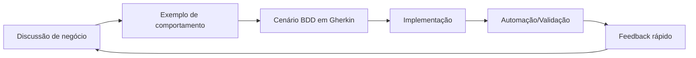
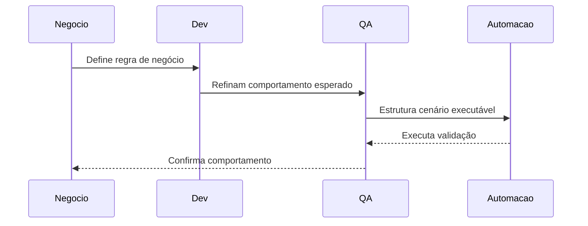

# O que é BDD

Behavior Driven Development (BDD ou Desenvolvimento Orientado por Comportamento) é uma abordagem de desenvolvimento de software focada em **descrever comportamentos esperados do sistema a partir da perspectiva do negócio**, promovendo alinhamento entre áreas técnicas e não técnicas.

Mais do que uma técnica de testes, BDD atua como uma ponte de comunicação entre negócio, desenvolvimento e qualidade, ajudando equipes a especificarem requisitos com mais clareza, descobrirem ambiguidades mais cedo e entregarem software orientado ao valor real para o usuário.

### Conceito Principal

- BDD significa **Behavior Driven Development**.
- Seu foco principal está em **descrever comportamentos observáveis** do sistema.
- Prioriza **o que o sistema deve fazer**, ao invés de como ele é implementado internamente.
- Utiliza exemplos concretos para transformar regras de negócio em cenários claros e verificáveis.
- Incentiva colaboração contínua entre todas as áreas envolvidas no produto.

### BDD não é apenas automação

Um erro comum é associar BDD apenas à automação de testes ou ao uso de ferramentas como Cucumber.

BDD **não é**:

- Apenas escrever testes automatizados;
- Apenas usar Gherkin/arquivos `.feature`;
- Apenas responsabilidade de QA/testadores;
- Uma ferramenta ou framework específico.

BDD **é**:

- Uma metodologia de colaboração;
- Uma prática de refinamento de requisitos;
- Uma forma estruturada de transformar regras de negócio em exemplos executáveis;
- Uma estratégia para reduzir ambiguidades antes da implementação.

### Objetivos do BDD

- Melhorar comunicação entre áreas.
- Garantir entendimento compartilhado sobre requisitos.
- Reduzir retrabalho causado por interpretação incorreta.
- Criar documentação viva do comportamento esperado.
- Facilitar validação contínua do software.

### Como o BDD funciona na prática

BDD geralmente segue um fluxo colaborativo:

1. Discussão da necessidade de negócio
2. Definição de exemplos concretos de comportamento
3. Transformação desses exemplos em cenários estruturados
4. Implementação da funcionalidade guiada pelos cenários
5. Automação opcional dos cenários como validação contínua

### Fluxo de Colaboração

### Exemplo de Interação Entre Papéis

### Linguagem Compartilhada (Ubiquitous Language)

BDD promove o uso de uma **linguagem ubíqua**, onde termos de negócio são compartilhados entre todos os envolvidos.

Isso significa que:

- Negócio, QA e Dev utilizam os mesmos termos para falar sobre regras.
- A documentação reflete exatamente a linguagem do domínio.
- Os testes representam cenários compreensíveis por qualquer stakeholder.

### Especificação por Exemplo

BDD é fortemente associado ao conceito de **Specification by Example** (Especificação por Exemplos).

Essa prática consiste em:

- Definir requisitos usando exemplos reais.
- Utilizar cenários concretos em vez de descrições abstratas.
- Facilitar entendimento através de casos práticos.

Exemplo:

Ao invés de dizer:

> "O sistema deve validar autenticação."

Define-se:

> "Quando um usuário inserir email e senha válidos, deve acessar o sistema com sucesso."

### Mentalidade Correta ao Aplicar BDD

> "Seus cenários devem direcionar sua implementação, não refleti-la."

Isso significa que:

- O cenário idealmente nasce **antes da implementação**.
- O desenvolvimento deve ser guiado pelo comportamento esperado.
- O código surge como consequência da regra previamente alinhada.

### Nota do criador

<blockquote>"Infelizmente, você não pode simplesmente baixar o Cucumber, começar a escrever os arquivos .features do Cucumber e esperar que um nirvana de verdade e iluminação aconteça por conta própria.
Há um processo a seguir que envolve muitas funções na equipe de software. Esse processo é chamado de BDD.
O BDD não é uma ferramenta que você pode baixar. Gojko Adzic deu ao BDD um nome novo e melhor: especificação por exemplo.”</blockquote>

 
<blockquote>"Seus Cenários no Cucumber devem direcionar sua implementação, não refleti-la.
Pense nisso por um minuto. Isso tem muitas implicações. Antes de tudo, significa que os recursos do Cucumber devem ser escritos antes do código que implementa o recurso.”</blockquote>

 
<blockquote>"Os contribuidores mais importantes dos requisitos não são programadores ou testadores - são analistas de negócios.
Durante essa atividade, a principal responsabilidade dos programadores e testadores é fazer perguntas e garantir que eles entendam tudo."</blockquote>

 

---

<i>Notas baseadas no curso de <a href="https://www.youtube.com/playlist?list=PLhJTa4U57yUuoZLHqiXXR97sMfy_Ia_3Q">BDD com Java do QAOps.</a></i>

